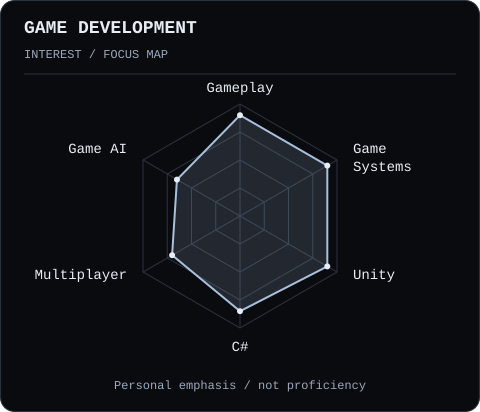
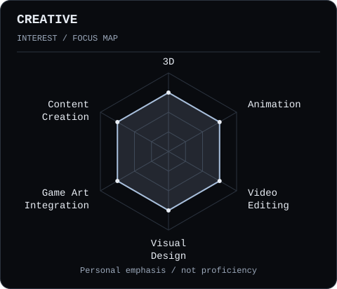
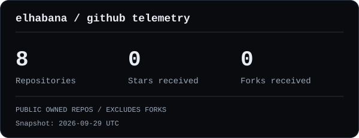
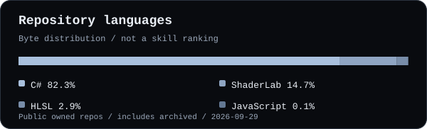
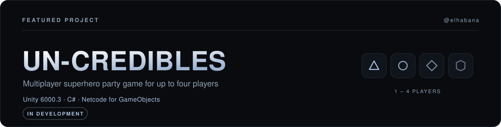

<picture>
  <source media="(prefers-color-scheme: dark)" srcset="assets/banner-dark.svg" />
  <source media="(prefers-color-scheme: light)" srcset="assets/banner-light.svg" />
  
</picture>

 

<picture>
  <source media="(prefers-color-scheme: light)" srcset="https://readme-typing-svg.demolab.com?font=JetBrains+Mono&amp;weight=500&amp;size=24&amp;duration=3000&amp;pause=1100&amp;color=42658D&amp;center=true&amp;vCenter=true&amp;width=880&amp;height=64&amp;lines=Cristian+Habana+%E2%80%94+Game+Developer+%26+Digital+Creator;Unity+%2F+C%23+%2F+Gameplay+Systems;Games+%C2%B7+3D+%C2%B7+Animation+%C2%B7+Audiovisual;Building+interactive+things%2C+one+system+at+a+time" />
  
</picture>

<!-- Add confirmed LinkedIn, portfolio, The Rookies or YouTube links here. -->

  

---

## this is me

I'm **Cristian Habana / elhabana**, a game developer working mainly with **Unity and C#**. I combine gameplay programming with 3D and audiovisual creation.

- **Gameplay & systems** — building game logic and reusable, organized architecture.
- **Multiplayer & game AI** — working on player systems for local, online and AI-controlled play.
- **3D & animation** — modeling, environments, assets and integration into interactive projects.
- **Visual & audiovisual** — asset editing, video montage and project presentation content.
- **Currently building UN-CREDIBLES**, a multiplayer superhero party game.
- **Additional experience: GTA Roleplay / FiveM** — adapting server assets and visual content, with small script adjustments and occasional Lua.

---

## my stack

<picture>
  <source media="(prefers-color-scheme: light)" srcset="https://skillicons.dev/icons?i=unity,cs,visualstudio,blender,ps&amp;theme=light&amp;perline=5" />
  
</picture>

  

&nbsp;

Game development · 3D &amp; visual · Audiovisual

---

## signals

<table>
<tr>
<td width="50%" align="center" valign="top">
<picture>
  <source media="(prefers-color-scheme: dark)" srcset="assets/radar-game-dark.svg" />
  <source media="(prefers-color-scheme: light)" srcset="assets/radar-game-light.svg" />
  
</picture>
</td>
<td width="50%" align="center" valign="top">
<picture>
  <source media="(prefers-color-scheme: dark)" srcset="assets/radar-creative-dark.svg" />
  <source media="(prefers-color-scheme: light)" srcset="assets/radar-creative-light.svg" />
  
</picture>
</td>
</tr>
</table>

Personal areas of interest and focus. Illustrative emphasis, not measured proficiency.

---

## github telemetry

<picture>
  <source media="(prefers-color-scheme: dark)" srcset="assets/github-stats-dark.svg" />
  <source media="(prefers-color-scheme: light)" srcset="assets/github-stats-light.svg" />
  
</picture>

  

<picture>
  <source media="(prefers-color-scheme: dark)" srcset="assets/languages.svg" />
  <source media="(prefers-color-scheme: light)" srcset="assets/languages-light.svg" />
  
</picture>

Public repository snapshot, including archived work. Language bytes describe code history, not my current stack.

---

## selected work

<picture>
  <source media="(prefers-color-scheme: dark)" srcset="assets/uncredibles-dark.svg" />
  <source media="(prefers-color-scheme: light)" srcset="assets/uncredibles-light.svg" />
  
</picture>

A **superhero party game for up to four players**: quick rounds, different minigames, humour and competitive chaos. Players earn points across challenges to decide the overall winner.

**Unity 6000.3 · C# · Netcode for GameObjects**

**In development:** player management, local and online multiplayer, AI players, lobby, match and scene flow, reusable minigames and character customization.

<!-- Add real gameplay footage and a verified public project URL when available.
     The SVG is a typographic project cover, not an in-game screenshot.
     No system is marked as implemented until its status is confirmed. -->

---

elhabana // code · create · iterate

