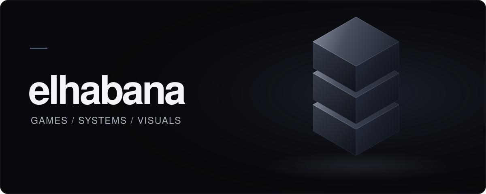
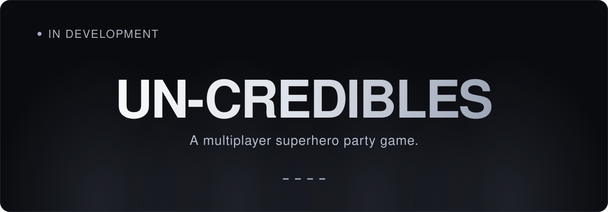

  

<h1 align="center">Cristian Habana</h1>

  <strong>Unity Game Developer · Gameplay Programmer 3D &amp; Audiovisual Creator</strong>

  <a href="#un-credibles">Featured project</a> &nbsp;·&nbsp;
  <a href="#what-i-do">What I do</a> &nbsp;·&nbsp;
  <a href="#tools-i-use">Tools I use</a>

<!-- Add verified portfolio / social links here when available. -->

## About

I develop games with **Unity and C#**, focusing on gameplay systems and reusable game architecture. I also work with **3D, animation and video**, combining programming with visual creation.

 

## UN-CREDIBLES

A multiplayer superhero party game for **up to four players**. Quick rounds, varied minigames, humour and competitive chaos. Players earn points in each challenge, with an overall winner at the end of the match.

We're building for **local and online play**, with human and AI-controlled players.

**Unity 6000.3 · C# · Netcode for GameObjects**

### Systems in development

- **Players & multiplayer** — local, online and AI player management, lobby and networking.
- **Match & scene flow** — scoring, minigame selection and transitions between scenes and rounds.
- **Reusable systems** — shared minigame architecture and character customization.

<!-- Real gameplay media: add assets/projects/uncredibles-gameplay.webp (or .gif)
     and embed it here with descriptive alt text once available.
     The cover above is an original typographic graphic, not a gameplay screenshot.
     Add a project / demo link only when its public URL is confirmed. -->

 

## What I do

### Gameplay & systems
Gameplay programming, game systems and reusable architecture. Multiplayer and game AI, with an emphasis on keeping projects organized as they grow.

### 3D & animation
Modeling, environments, assets and animation — from creating content to integrating it into interactive projects.

### Audiovisual
Video editing and montage, social content and project presentation videos, especially for games.

 

## Tools I use

**Game development** &nbsp; Unity · C# · Visual Studio

**3D & visual** &nbsp; Blender · Photoshop

**Audiovisual** &nbsp; DaVinci Resolve · CapCut

 

## Additional experience

I've also worked with **GTA Roleplay / FiveM** content: modifying server assets, adapting visual resources, and organizing and customizing existing content. This included small script adjustments and occasional use of Lua.

## Current focus

Building **UN-CREDIBLES** with Unity and C#: reusable gameplay systems, multiplayer architecture and game AI.

---

elhabana · Cristian Habana

