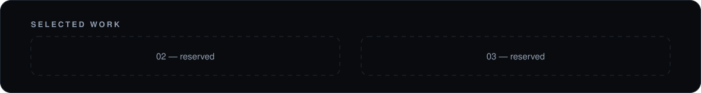

<picture>
  <source media="(prefers-color-scheme: dark)" srcset="assets/banner-dark.svg" />
  <source media="(prefers-color-scheme: light)" srcset="assets/banner-light.svg" />
  
</picture>

 

<picture>
  <source media="(prefers-color-scheme: dark)" srcset="assets/memes/dev-memes-dark.svg" />
  <source media="(prefers-color-scheme: light)" srcset="assets/memes/dev-memes-light.svg" />
  
</picture>

## About

I build games and gameplay systems, mainly with **Unity** and **C#**.
I also work across 3D, animation and audiovisual production, so a project can go from idea to playable without changing hands.

Right now that work is **UN-CREDIBLES**, a multiplayer superhero party game. I like systems that stay readable when the project grows.

 

<b>MAIN</b> 
<picture>
  <source media="(prefers-color-scheme: dark)" srcset="https://skillicons.dev/icons?i=unity,cs&amp;theme=dark&amp;perline=2" />
  <source media="(prefers-color-scheme: light)" srcset="https://skillicons.dev/icons?i=unity,cs&amp;theme=light&amp;perline=2" />
  
</picture>

  

<b>CREATIVE</b> 
<picture>
  <source media="(prefers-color-scheme: dark)" srcset="https://skillicons.dev/icons?i=blender,ps&amp;theme=dark&amp;perline=2" />
  <source media="(prefers-color-scheme: light)" srcset="https://skillicons.dev/icons?i=blender,ps&amp;theme=light&amp;perline=2" />
  
</picture>

  

<b>TOOLS</b> 
<picture>
  <source media="(prefers-color-scheme: dark)" srcset="https://skillicons.dev/icons?i=vscode&amp;theme=dark" />
  <source media="(prefers-color-scheme: light)" srcset="https://skillicons.dev/icons?i=vscode&amp;theme=light" />
  
</picture>

  

OTHER EXPERIENCE &nbsp;·&nbsp; FiveM · Lua · HTML · CSS

## UN-CREDIBLES

<picture>
  <source media="(prefers-color-scheme: dark)" srcset="assets/uncredibles-dark.svg" />
  <source media="(prefers-color-scheme: light)" srcset="assets/uncredibles-light.svg" />
  
</picture>

A superhero party game for up to four players: short rounds, a different minigame each time, and points that decide the winner.

**Unity 6000.3 · C# · Netcode for GameObjects**

**My role** — Programming · Gameplay Systems · Technical Design

**In development** — player management, local and online multiplayer, AI players, lobby, match and scene flow, reusable minigames and character customization. These systems are being built; none of them is finished yet.

## GitHub Stats

<picture>
  <source media="(prefers-color-scheme: dark)" srcset="https://github-readme-activity-graph.vercel.app/graph?username=elhabana&amp;bg_color=00000000&amp;color=E8EDF4&amp;title_color=A9C0DD&amp;line=A9C0DD&amp;point=E8EDF4&amp;area=true&amp;area_color=2B333F&amp;hide_border=true&amp;grid=false&amp;radius=12&amp;height=240&amp;days=31&amp;custom_title=Activity" />
  <source media="(prefers-color-scheme: light)" srcset="https://github-readme-activity-graph.vercel.app/graph?username=elhabana&amp;bg_color=00000000&amp;color=1F2937&amp;title_color=42658D&amp;line=42658D&amp;point=1F2937&amp;area=true&amp;area_color=D3DAE3&amp;hide_border=true&amp;grid=false&amp;radius=12&amp;height=240&amp;days=31&amp;custom_title=Activity" />
  
</picture>

 

<picture>
  <source media="(prefers-color-scheme: dark)" srcset="https://github-readme-stats.vercel.app/api/top-langs/?username=elhabana&amp;layout=compact&amp;langs_count=5&amp;hide_border=true&amp;bg_color=00000000&amp;title_color=A9C0DD&amp;text_color=E8EDF4&amp;custom_title=Languages" />
  <source media="(prefers-color-scheme: light)" srcset="https://github-readme-stats.vercel.app/api/top-langs/?username=elhabana&amp;layout=compact&amp;langs_count=5&amp;hide_border=true&amp;bg_color=00000000&amp;title_color=42658D&amp;text_color=1F2937&amp;custom_title=Languages" />
  
</picture>
&nbsp;
<picture>
  <source media="(prefers-color-scheme: dark)" srcset="https://github-readme-stats.vercel.app/api/?username=elhabana&amp;show_icons=false&amp;hide_rank=true&amp;hide=issues,contribs&amp;hide_border=true&amp;bg_color=00000000&amp;title_color=A9C0DD&amp;text_color=E8EDF4&amp;custom_title=Overview" />
  <source media="(prefers-color-scheme: light)" srcset="https://github-readme-stats.vercel.app/api/?username=elhabana&amp;show_icons=false&amp;hide_rank=true&amp;hide=issues,contribs&amp;hide_border=true&amp;bg_color=00000000&amp;title_color=42658D&amp;text_color=1F2937&amp;custom_title=Overview" />
  
</picture>

  

Activity, languages and a short overview, read from public GitHub data.

## Selected Work

UN-CREDIBLES is where my time goes right now, so this list is deliberately short.

<picture>
  <source media="(prefers-color-scheme: dark)" srcset="assets/projects/reserved-dark.svg" />
  <source media="(prefers-color-scheme: light)" srcset="assets/projects/reserved-light.svg" />
  
</picture>

<!-- To add an entry: drop a cover in assets/projects/, add a <picture> block
     above with a dark and a light source, and keep it to one or two lines. -->

---

elhabana // code · create · iterate

  

<a href="https://github.com/elhabana">GitHub</a> &nbsp;·&nbsp; <a href="https://www.youtube.com/@elhabana">YouTube</a> &nbsp;·&nbsp; <a href="https://www.instagram.com/elhabana">Instagram</a> &nbsp;·&nbsp; <a href="https://www.twitch.tv/elhabanaaa">Twitch</a> &nbsp;·&nbsp; <a href="https://kick.com/elhabanaa">Kick</a>

  

Cristian Rivero Llácer

